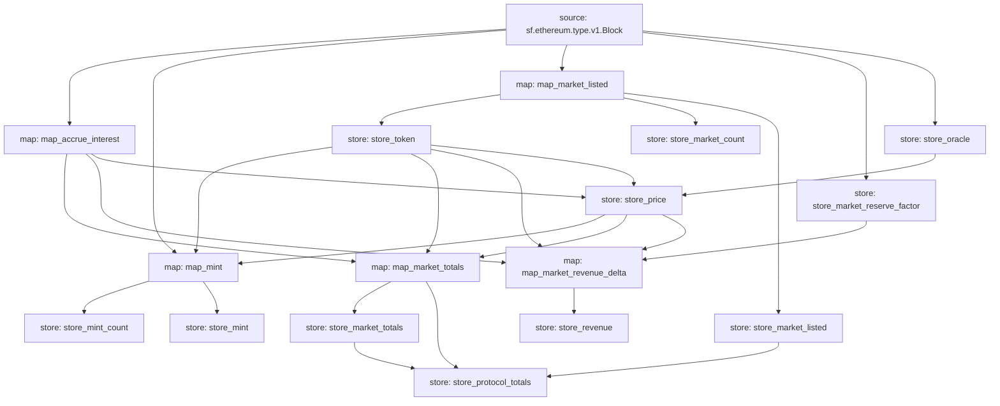

# CompoundV2 Substreams

Ongoing effort to index Compound V2 using substreams.

## Architecture



## Quick Start

### Install

Run `go install ./cmd/substreams` under `substreams` repo `develop` branch to get the latest `substreams` cli.

Run `brew install bufbuild/buf/buf` to install `buf`.

### Build

Generate src/pb

```bash
make codegen
```

Build

```bash
make build
```

### Run

```bash
sftoken
substreams run -e api-dev.streamingfast.io:443 substreams.yaml map_market_listed,store_market --start-block 7710778 --stop-block +10
```

## Implemented Schema

LendingProtocol
- oracle
- totalPoolCount
- totalValueLockedUSD
- totalBorrowBalanceUSD
- cumulativeTotalRevenueUSD
- cumulativeProtocolSideRevenueUSD
- cumulativeSupplySideRevenueUSD

Market
- inputToken
- outputToken
- reserveFactor
- totalValueLockedUSD
- totalBorrowBalanceUSD
- cumulativeTotalRevenueUSD
- cumulativeProtocolSideRevenueUSD
- cumulativeSupplySideRevenueUSD

Token
- address
- name
- symbol
- decimals
- lastPriceUSD

UsageMetricsDailySnapshot
- dailyDepositCount

MarketDailySnapshot
- dailyTotalRevenueUSD
- dailyProtocolSideRevenueUSD
- dailySupplySideRevenueUSD

FinancialsDailySnapshot
- dailyTotalRevenueUSD
- dailyProtocolSideRevenueUSD
- dailySupplySideRevenueUSD

## Troubleshooting

Running `store_*` module could produce the below error. Just ignore it and retry.

```
Error: rpc error: code = Unknown desc = error building pipeline: synchronizing stores: from worker: calling back scheduler: squashing: merging partials: initializing next partial store "store_transfers": storage file 0012289000-0012288000.partial: not found
```
