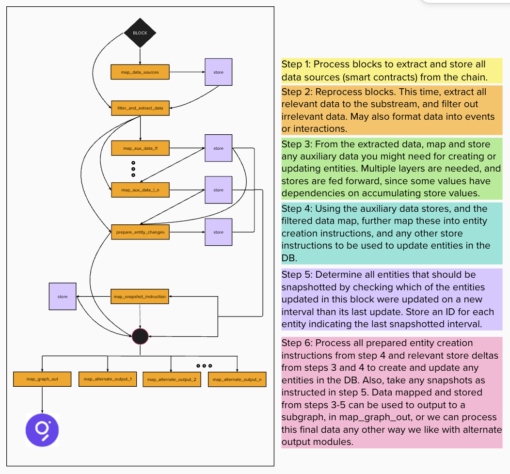

# Uniswap V3 Substream
This substream uses a modified version of the DEX AMM subgraph schema to index Uniswap V3 data. It is currently in an intermediate state, and is not yet ready for production use. This project might be a good starting point for anyone interested in building a substream as many of the patterns used are applicable to other substreams. The inspiration for the substream can be found at this [here](https://engineering.messari.io/blog/parallel-indexing-of-blockchain-data-with-substreams).

## How it works
The current implementation and plan for this substream can be broken down into 6 steps, each corresponding to a file in the `modules/` folder.

1. Store Data Sources
    - Index the block chain and store all relevant smart contracts with their addresses to use for extracting protocol specific data. 
2. Filter and extract data (Unimplemented)
    - Extract all relevant data from the blockchain for the protocol(s) you are trying to index. Ideally the output from this module is standardized across all substreams. I propose that we think about the data in terms of interactions in the article above, but it may be that we just use some ad hoc data types to map call traces and event logs to. Another reason we want to make this its own step is so that you do not have to repeatedly process the entire block in subsequent modules.
3. Store Auxiliary Data
    - Store any data that needs to be accumulated or referenced over time. For example, if you want to calculate the total fee on a swap, you need to know the current fee for the pool. So, in this step, the fee is stored, so that it can be used in the next module. Any data that has a dependency on stored/accumulated data should be stored here. There might be multiple layers of mapping and storage in this step. The output from the map module is a vector of store operation messages, and then there are storage modules which process this map output and automatically handles the storage of the data according to the mapped store operation messages. The storage modules are intended to be generic and reusable across substreams.
4. Prepare Entity Changes
    - This step is intended to take the data extracted in step 2 and transform it into a format that can be used to update the graph. This is where we would map the data to the graph schema. This step is also where we would calculate any derived data that is not available in the current block's data. For example, if we want to calculate the total fee on a swap, we would need to know the current fee for the pool, which is stored in step 3. We would then use that data to calculate the total fee and create any corresponding entity creation or store operation messages. The output from this module is a data structure with 2 vectors: A vector of store operations like in step 3, and a vector of entity creation messages. 
5. Prepare Entity Snapshots (Unimplemented)
    - The purpose of this step is to determine the entities that have been updated from the previous modules and see if they are updated on a new interval. If the are, then send forward a message to take a snapshot over that interval and determine cumulative deltas by looking at the most recent snapshot interval as implemented in Messari subgraphs. 
6. Graph Out
    - The purpose of this module is to read the store deltas from steps 3-4 and apply any values in the store that indicated updates to an entity - these are handled by identifying the `entity-change` key at the first index. Additionally, process the entity creation messages from step 4 and use the entity creation logic in the schema library to create these entities. Entities ought to be created before they are updated from store deltas. The EntityCreations output from step 4 can be differentiated into types that are recognized by the schema lib, by looping, matching on the type, and calling the schema lib function to create the entity. Finally, the snapshots messages are processed and snapshots are taken in this module as well use current values and the differences between the most recent snapshot for non-cumulative values. 

- The `schema_lib` folder contains the code for the schema library. The `schema_lib` folder is intended to be a standalone library that can be used by any substream for the specific schema type - in this instance DEX. The `dex_amm.proto` contains the protobuf messages that correspond to entity creations that are to be output from step 4. Each of these messages should correspond to a function that is specified in the `enitity_creations` folder and called in the `map.rs` file used by the graph out module.

- The `store` folder contains implementations for creating store instructions and entity creations. These implementations are meant to be standard for all DEXs and create either the entity change messages from the `dex_amm.proto` or the store operations from the `store.proto` in `../common/proto/`. The `store.proto` is intended to contain generic store operations that can be used by any substream through the methods implemented on the StoreOperations type that create these messages particular to the schema.

- The `interactions` folder contains a set of files that each represent a type of interaction a user might have with a protocol, and logic for creating entities and storing updates to either be used as entity changes, or auxiliary data for creating other entity changes. Some interactions will be processed multiple times due to data dependencies, which is why there are different functions in these files that are called by the separate modules that map blocks/interactions into entity creation and store operation messages.

## Vision
- Many of the design choices made in the substream were made such that there could be a lot of code reuse across substreams, and even more so when the schemas are the same. Other DEXs can use the same entity creation messages in the `dex_amm.proto` and the store operations messages by using the implemented types in `Store/SDK.rs`. In order to start working with a new schema, you would just create a new `schema_lib` folder corresponding to the new protocol schema and a new implementation for the StoreOperationFactory and EntityUpdateFactory structs in `store/SDK.rs ` that correspond with the new schema. Then, you can map the substream in the step-by-step process outlined above. Additionally, the vision is that there would be no changes necessary for modules 1-2 and 5-6, and each substream would just have to implement specific logic if it is new schema in the `schema_lib` and SDK, and if it is a new protocol, which would involve writing code for modules 3-4 with whatever helper functions needed.
